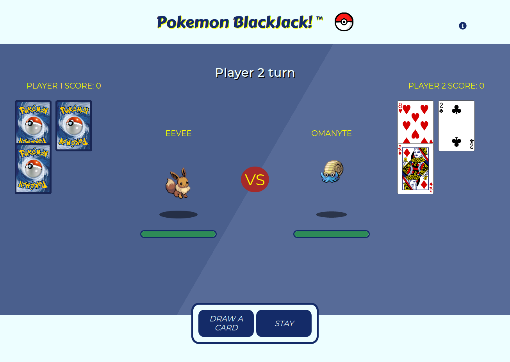

# Pokémon Blackjack
## Juno College Project 6 - React Mob Programming Project

## Live Link
https://pokemonblackjack.github.io/pokemonBlackJack/

## Project Scope

### Project description:
The latest and greatest Pokémon battle has arrived! This app should be a Blackjack style
card game between two Pokémon characters. Using the PokéAPI and the Deck of Cards
API, have two two randomly generated characters play a game of black jack and the winner
evolves!

### Requirements:
- [x] Uses the PokéAPI and the Deck of Cards API
- [x] User operates both characters (ie. clicks buttons to generate next card, stay, etc)
- [x] Ensure both characters are able to evolve, you may need to be specific about this in your query
- [x] Game should be keyboard operable
- [x] Display a visual indicator of who won, and what evolution they experienced
- [x] Proper error handling. For example:
- - [x] Common error responses should be handled

### Stretch goals:
- [x] Dealer mode where operator is the dealer playing against 2 Pokémon
- [x] Animation for winning pokemon

### Deliverables:
- [x] Project files up on GitHub
- [x] Project up on GitHub pages or your own URL
- [x] All requirements completed BEFORE any stretch goals have been attempted

## Project 6 (agency-style group React application)

### Requirements:

- [x] Uses React, and no jQuery
- [x] Uses flexbox or grid where appropriate
- [x] Uses Axios and/or Firebase
- [x] Every group member has at least one significant commit on GitHub
- [x] React 'knows' about all DOM changes (bind your inputs! don't use vanilla JS to manipulate the DOM! .setState() is always used to alter state!)
- [x] App is dynamic based on user interaction (e.g. drop down menu, search field)
- [x] It is clear to the user what the app does
- [x] App and interactions are accessible
- [x] Errors are handled effectively
- [x] Site is live on student's own URL or GitHub Pages

## References

[Pokemon Sound Effects](https://downloads.khinsider.com/game-soundtracks/album/pokemon-gameboy-sound-collection)
[Additional Pokemon Sounds](https://downloads.khinsider.com/game-soundtracks/album/pokemon-gold-silver-crystal)